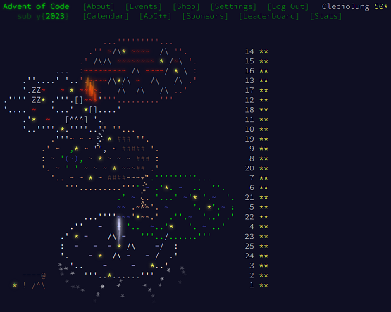

# Advent of Code 2023 Solutions

This repository contains my solutions to the Advent of Code 2023 challenges. I'm using this problems to learn some programming languages such as Rust, Golang, Pascal, etc.



## Problems

- [Day 01](day01/description.txt): [Rust Solution](day01/src/main.rs)
- [Day 02](day02/description.txt): [Rust Solution](day02/src/main.rs)
- [Day 03](day03/description.txt): [Rust Solution](day03/src/main.rs)
- [Day 04](day04/description.txt): [Rust Solution](day04/src/main.rs)
- [Day 05](day05/description.txt): [Rust Solution](day05/src/main.rs)
- [Day 06](day06/description.txt): [Golang Solution](day06/main.go)
- [Day 07](day07/description.txt): [Golang Solution](day07/main.go)
- [Day 08](day08/description.txt): [Golang Solution](day08/main.go)
- [Day 09](day09/description.txt): [Golang Solution](day09/main.go)
- [Day 10](day10/description.txt): [Golang Solution](day10/main.go)
- [Day 11](day11/description.txt): [Java Solution](day11/Main.java)
- [Day 12](day12/description.txt): [Java Solution](day12/Main.java)
- [Day 13](day13/description.txt): [Java Solution](day13/Main.java)
- [Day 14](day14/description.txt): [Java Solution](day14/Main.java)
- [Day 15](day15/description.txt): [Java Solution](day15/Main.java)
- [Day 16](day16/description.txt): [Javascript Solution](day16/main.js)
- [Day 17](day17/description.txt): [Python Solution](day17/main.py)
- [Day 18](day18/description.txt): [C++ Solution](day18/main.cpp)
- [Day 19](day19/description.txt): [Lua Solution](day19/main.lua)
- [Day 20](day20/description.txt): [Pascal Solution](day20/main.pas)
- [Day 21](day21/description.txt): [Julia Solution](day21/main.jl)
- [Day 22](day22/description.txt): [Perl Solution](day22/main.pm)
- [Day 23](day23/description.txt): [D Solution](day23/main.d)
- [Day 24](day24/description.txt): [Php Solution](day24/main.php)
- [Day 25](day25/description.txt): [Kotlin Solution](day25/main.kt)

## How to run

To run a program for a specific day, simply use the `make` command followed by the day number. For example, to run the program for day 1:

```console
make day01
```

Replace `day01` with the desired day and its number.

If you want to run all programs in order, you can use the following command:

```console
make
```

This will execute all the programs sequentially.

Note: Make sure you have the necessary dependencies and configurations set up before running the programs.

## Environment

```console
$ neofetch
             ...-:::::-...                 cj@cj-box 
          .-MMMMMMMMMMMMMMM-.              --------- 
      .-MMMM`..-:::::::-..`MMMM-.          OS: Linux Mint 21.1 x86_64 
    .:MMMM.:MMMMMMMMMMMMMMM:.MMMM:.        Host: VirtualBox 1.2 
   -MMM-M---MMMMMMMMMMMMMMMMMMM.MMM-       Kernel: 5.15.0-91-generic 
 `:MMM:MM`  :MMMM:....::-...-MMMM:MMM:`    Uptime: 43 mins 
 :MMM:MMM`  :MM:`  ``    ``  `:MMM:MMM:    Packages: 2919 (dpkg) 
.MMM.MMMM`  :MM.  -MM.  .MM-  `MMMM.MMM.   Shell: bash 5.1.16 
:MMM:MMMM`  :MM.  -MM-  .MM:  `MMMM-MMM:   Resolution: 1920x974 
:MMM:MMMM`  :MM.  -MM-  .MM:  `MMMM:MMM:   DE: Cinnamon 5.6.8 
:MMM:MMMM`  :MM.  -MM-  .MM:  `MMMM-MMM:   WM: Mutter (Muffin) 
.MMM.MMMM`  :MM:--:MM:--:MM:  `MMMM.MMM.   WM Theme: Mint-Y-Dark-Aqua (Mint-Y) 
 :MMM:MMM-  `-MMMMMMMMMMMM-`  -MMM-MMM:    Theme: Mint-Y-Aqua [GTK2/3] 
  :MMM:MMM:`                `:MMM:MMM:     Icons: Mint-Y-Aqua [GTK2/3] 
   .MMM.MMMM:--------------:MMMM.MMM.      Terminal: vscode 
     '-MMMM.-MMMMMMMMMMMMMMM-.MMMM-'       CPU: Intel i7-7700HQ (4) @ 2.808GHz 
       '.-MMMM``--:::::--``MMMM-.'         GPU: 00:02.0 VMware SVGA II Adapter 
            '-MMMMMMMMMMMMM-'              Memory: 2546MiB / 7937MiB 
               ``-:::::-``

$ make --version
GNU Make 4.3
Built for x86_64-pc-linux-gnu
Copyright (C) 1988-2020 Free Software Foundation, Inc.
License GPLv3+: GNU GPL version 3 or later <http://gnu.org/licenses/gpl.html>
This is free software: you are free to change and redistribute it.
There is NO WARRANTY, to the extent permitted by law.

$ cargo --version
cargo 1.70.0

$ go version
go version go1.18.1 linux/amd64

$ javac --version
javac 11.0.21

$ java --version
openjdk 11.0.21 2023-10-17
OpenJDK Runtime Environment (build 11.0.21+9-post-Ubuntu-0ubuntu122.04)
OpenJDK 64-Bit Server VM (build 11.0.21+9-post-Ubuntu-0ubuntu122.04, mixed mode, sharing)

$ node --version
v12.22.9

$ python3 --version
Python 3.10.12

$ g++ --version
g++ (Ubuntu 11.4.0-1ubuntu1~22.04) 11.4.0
Copyright (C) 2021 Free Software Foundation, Inc.
This is free software; see the source for copying conditions.  There is NO
warranty; not even for MERCHANTABILITY or FITNESS FOR A PARTICULAR PURPOSE.

$ lua -v
Lua 5.4.4  Copyright (C) 1994-2022 Lua.org, PUC-Rio

$ fpc -iV
3.2.2

$ julia -v
julia version 1.6.7

$ perl -v

This is perl 5, version 34, subversion 0 (v5.34.0) built for x86_64-linux-gnu-thread-multi
(with 60 registered patches, see perl -V for more detail)

Copyright 1987-2021, Larry Wall

Perl may be copied only under the terms of either the Artistic License or the
GNU General Public License, which may be found in the Perl 5 source kit.

Complete documentation for Perl, including FAQ lists, should be found on
this system using "man perl" or "perldoc perl".  If you have access to the
Internet, point your browser at http://www.perl.org/, the Perl Home Page.

$ dmd --version
DMD64 D Compiler v2.106.1
Copyright (C) 1999-2023 by The D Language Foundation, All Rights Reserved written by Walter Bright

$ php --version
PHP 8.1.2-1ubuntu2.14 (cli) (built: Aug 18 2023 11:41:11) (NTS)
Copyright (c) The PHP Group
Zend Engine v4.1.2, Copyright (c) Zend Technologies
    with Zend OPcache v8.1.2-1ubuntu2.14, Copyright (c), by Zend Technologies

$ kotlinc -version
info: kotlinc-jvm 1.3-SNAPSHOT (JRE 11.0.21+9-post-Ubuntu-0ubuntu122.04)
```
